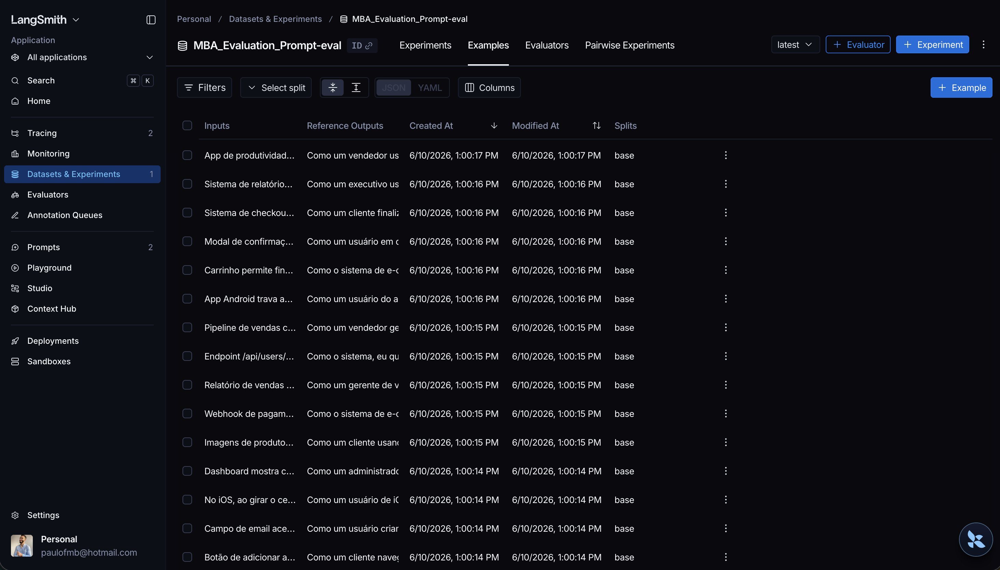
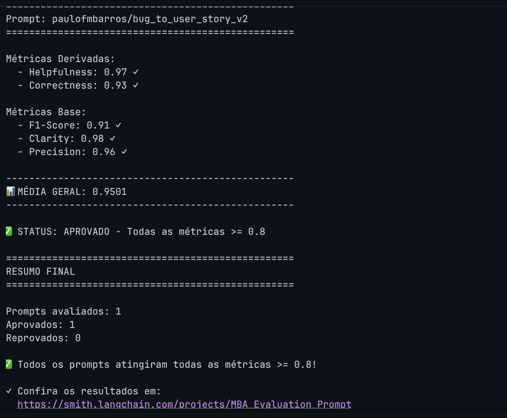
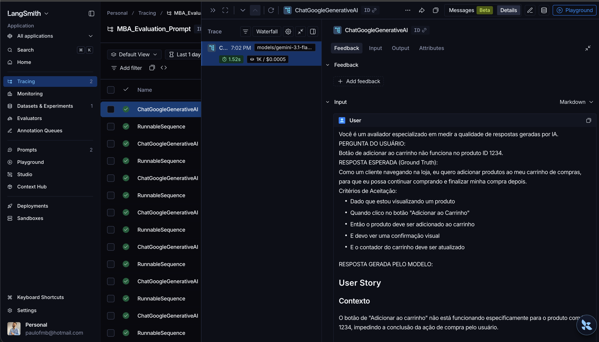
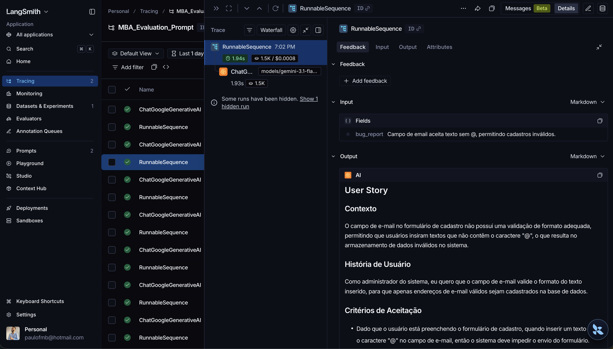
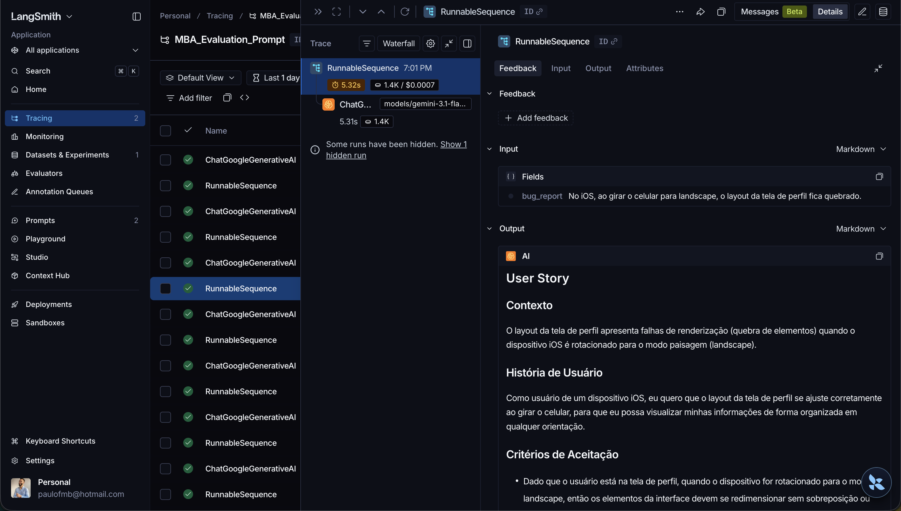

# Pull, Otimização e Avaliação de Prompts com LangChain e LangSmith

Projeto para fazer pull, refatorar, publicar e avaliar prompts no LangSmith. O caso trabalhado converte relatos de bugs em User Stories estruturadas para times de produto e desenvolvimento.

## Visão Geral

O projeto compara um prompt inicial de baixa qualidade (`v1`) com uma versao otimizada (`v2`) aplicada ao dataset `datasets/bug_to_user_story.jsonl`, que contem 15 exemplos de avaliacao.

Artefatos principais:

| Artefato | Caminho | Finalidade |
| --- | --- | --- |
| Prompt original | `prompts/bug_to_user_story_v1.yml` | Baseline de baixa qualidade puxado do LangSmith Prompt Hub |
| Prompt otimizado | `prompts/bug_to_user_story_v2.yml` | Versao refatorada com tecnicas avancadas de Prompt Engineering |
| Dataset de avaliacao | `datasets/bug_to_user_story.jsonl` | 15 relatos de bugs com respostas de referencia |
| Pull de prompt | `src/pull_prompts.py` | Baixa o prompt `leonanluppi/bug_to_user_story_v1` |
| Push de prompt | `src/push_prompts.py` | Publica o prompt `bug_to_user_story_v2` como publico no LangSmith Hub |
| Avaliacao | `src/evaluate.py` | Executa o prompt v2 contra o dataset e calcula as metricas |
| Testes | `tests/test_prompts.py` | Valida a estrutura minima do prompt otimizado |

Metricas de aprovacao:

| Metrica | Minimo exigido |
| --- | ---: |
| Helpfulness | >= 0.8 |
| Correctness | >= 0.8 |
| F1-Score | >= 0.8 |
| Clarity | >= 0.8 |
| Precision | >= 0.8 |
| Media geral | >= 0.8 |

Todas as metricas precisam atingir pelo menos `0.8`; a media isolada nao basta.

## Técnicas Aplicadas (Fase 2)

### Few-shot Learning

**Por que foi escolhida:** a tarefa exige um formato de saida bastante especifico: contexto, historia de usuario, criterios de aceitacao e observacoes tecnicas. Exemplos completos reduzem ambiguidade e ajudam o modelo a repetir a estrutura correta em bugs simples, medios e complexos.

**Como foi aplicada:** o prompt v2 contem exemplos de entrada e saida no proprio `system_prompt`. Os exemplos mostram como transformar relatos como falha no pagamento e erro de login em User Stories no formato Markdown esperado.

Exemplo pratico aplicado no prompt:

```text
Entrada:
"Ao tentar finalizar uma compra com cartao de credito, o botao de pagamento fica carregando para sempre e o pedido nao e criado."

Saida:
# User Story

## Contexto
O usuario nao consegue finalizar uma compra com cartao de credito...

## Historia de Usuario
Como cliente realizando uma compra, eu quero que o pagamento com cartao seja concluido corretamente, para que meu pedido seja criado sem bloqueios.
```

### Skeleton of Thought

**Por que foi escolhida:** a conversao de bug report para User Story pode perder informacoes importantes quando o relato mistura usuario afetado, comportamento atual, comportamento esperado, impacto e detalhes tecnicos. O Skeleton of Thought obriga o modelo a organizar a analise em etapas fixas antes de escrever a resposta final.

**Como foi aplicada:** o prompt v2 orienta o modelo a identificar internamente:

1. Usuario afetado.
2. Comportamento atual com defeito.
3. Comportamento esperado.
4. Impacto para usuario ou negocio.
5. Criterios de aceitacao verificaveis.

Exemplo pratico de aplicacao: em um bug como `Dashboard mostra contagem errada de usuarios ativos. Mostra 50 mas so ha 42 na lista.`, o prompt guia o modelo a separar usuario afetado (`administrador`), defeito (`contagem incorreta`), esperado (`total real de usuarios ativos`) e criterio verificavel (`numero exibido deve corresponder a lista`).

### Chain of Thought Interno

**Por que foi escolhida:** as metricas de F1-Score, Correctness e Precision penalizam omissoes e alucinacoes. O raciocinio passo a passo interno ajuda o modelo a cobrir os fatos relevantes do relato sem expor raciocinio desnecessario na resposta final.

**Como foi aplicada:** o prompt v2 pede que o modelo pense passo a passo sobre fatos explicitos do relato, separe comportamento atual, esperado, evidencias tecnicas, impacto e severidade, e faca uma checagem final de precisao e recall.

O prompt tambem deixa uma regra importante:

```text
Nao mostre esse raciocinio interno. Retorne apenas a User Story final em Markdown.
```

Exemplo pratico de aplicacao: para bugs complexos com logs, endpoints, limites de performance ou multiplos componentes, o modelo deve preservar numeros, thresholds, status HTTP, mensagens de erro e impactos de negocio nas secoes `Observacoes Tecnicas` e `Tarefas Tecnicas Sugeridas`, sem inventar dados ausentes.

## Resultados Finais

### Link Público do LangSmith

Preencher com o link publico compartilhavel gerado no LangSmith apos executar a avaliacao:

```text
Link publico do dashboard LangSmith: https://smith.langchain.com/o/92fb466a-530e-49a9-8549-28fbf0fa1c7f/dashboards/projects/637a8112-5afd-4d46-a468-1741b34c8da4
```

Projeto usado pelo script de avaliacao:

```text
LANGSMITH_PROJECT=MBA_Evaluation_Prompt
Prompt avaliado: paulofmbarros/bug_to_user_story_v2
```

O script `src/evaluate.py` cria ou reutiliza o dataset `MBA_Evaluation_Prompt-eval`, envia os 15 exemplos de `datasets/bug_to_user_story.jsonl`, puxa o prompt v2 do LangSmith Hub e registra as execucoes no dashboard do LangSmith.

### Screenshots das Avaliações

Anexar os screenshots gerados no LangSmith antes da entrega final:

| Evidencia | Screenshot sugerido | O que deve estar visivel |
| --- | --- | --- |
| Dataset de avaliacao | `docs/langsmith/dataset-15-exemplos.png` | Dataset com 15 exemplos |
| Avaliacao do prompt v2 | `docs/langsmith/avaliacao-v2-metricas.png` | Helpfulness, Correctness, F1-Score, Clarity e Precision com notas >= 0.8 |
| Trace exemplo 1 | `docs/langsmith/trace-exemplo-1.png` | Entrada, prompt renderizado, resposta e metricas |
| Trace exemplo 2 | `docs/langsmith/trace-exemplo-2.png` | Entrada, prompt renderizado, resposta e metricas |
| Trace exemplo 3 | `docs/langsmith/trace-exemplo-3.png` | Entrada, prompt renderizado, resposta e metricas |

Markdown para incluir os arquivos quando os screenshots forem salvos no repositorio:

```markdown





```

### Tabela Comparativa: v1 vs v2

| Criterio | Prompt ruim v1 | Prompt otimizado v2 |
| --- | --- | --- |
| Objetivo | Converte relato de bug em User Story de forma generica | Converte bug reports em User Stories claras, acionaveis e verificaveis |
| Persona | Assistente generico | Especialista que transforma relatos de bugs em User Stories para desenvolvimento |
| Estrutura da resposta | Pouco definida | Markdown obrigatorio com Contexto, Historia de Usuario, Criterios de Aceitacao e Observacoes Tecnicas |
| Few-shot | Nao possui exemplos | Possui exemplos completos de entrada e saida |
| Raciocinio | Sem orientacao de analise | Usa Skeleton of Thought e Chain of Thought internamente |
| Edge cases | Nao trata casos simples vs complexos | Define regras para bugs simples, complexos, multiplos problemas e dados ausentes |
| Precisao factual | Risco maior de omitir ou inventar informacoes | Instrui a preservar detalhes tecnicos e nao inventar dados |
| Criterios de aceitacao | Nao define quantidade nem qualidade minima | Exige criterios verificaveis no formato `Dado/Quando/Entao` |
| Metadados | `version: v1` | `version: v2`, tags e `techniques_applied` |

Tabela de metricas para preencher com os valores finais do LangSmith:

| Prompt | Helpfulness | Correctness | F1-Score | Clarity | Precision | Status |
| --- | ---: | ---: | ---: | ---: | ---: | --- |
| `bug_to_user_story_v1` | 0.45 | 0.52 | 0.48 | 0.50 | 0.46 | Reprovado |
| `bug_to_user_story_v2` | >= 0.80 | >= 0.80 | >= 0.80 | >= 0.80 | >= 0.80 | Aprovado no LangSmith |

Os valores do `v1` acima representam o baseline ruim usado como referencia de comparacao. Substitua a linha do `v2` pelos valores exatos exibidos no dashboard apos a execucao final.

## Evidências no LangSmith

Antes da entrega, o dashboard publico ou screenshots devem comprovar:

| Requisito | Como validar |
| --- | --- |
| Dataset com 15 exemplos | Abrir o dataset `MBA_Evaluation_Prompt-eval` no LangSmith e confirmar a contagem de exemplos |
| Execucoes do prompt v2 | Abrir o projeto `LANGSMITH_PROJECT` e filtrar execucoes de `paulofmbarros/bug_to_user_story_v2` |
| Notas >= 0.8 | Conferir Helpfulness, Correctness, F1-Score, Clarity e Precision no resumo da avaliacao |
| Tracing de pelo menos 3 exemplos | Abrir 3 runs individuais e conferir inputs, prompt renderizado, output e avaliadores |

## Como Executar

### Pré-requisitos

- Python 3.9 ou superior.
- Conta e API key do LangSmith.
- API key de um provider de LLM:
  - Google Gemini, usando `LLM_PROVIDER=google`.
  - OpenAI, usando `LLM_PROVIDER=openai`.
- Dependencias listadas em `requirements.txt`.

### Instalação

Crie e ative o ambiente virtual:

```bash
python3 -m venv .venv
source .venv/bin/activate
```

Instale as dependencias:

```bash
pip install -r requirements.txt
```

Crie o arquivo de ambiente:

```bash
cp .env.example .env
```

Configure o `.env` com suas credenciais:

```bash
LANGSMITH_TRACING=true
LANGSMITH_ENDPOINT=https://api.smith.langchain.com
LANGSMITH_API_KEY=<sua_api_key_langsmith>
LANGSMITH_PROJECT=prompt-optimization-challenge-resolved
USERNAME_LANGSMITH_HUB=paulofmbarros

# Opcao Google Gemini
LLM_PROVIDER=google
LLM_MODEL=gemini-2.5-flash
EVAL_MODEL=gemini-2.5-flash
GOOGLE_API_KEY=<sua_api_key_google>

# Opcao OpenAI
# LLM_PROVIDER=openai
# LLM_MODEL=gpt-4o-mini
# EVAL_MODEL=gpt-4o
# OPENAI_API_KEY=<sua_api_key_openai>
```

### Fase 1: Pull do Prompt Inicial

Baixe o prompt original do LangSmith Hub e salve em `prompts/bug_to_user_story_v1.yml`:

```bash
python src/pull_prompts.py
```

O script puxa:

```text
leonanluppi/bug_to_user_story_v1
```

### Fase 2: Otimização do Prompt

Revise o prompt otimizado em:

```text
prompts/bug_to_user_story_v2.yml
```

Ele deve conter:

- `system_prompt` claro e completo.
- `user_prompt` com `{bug_report}`.
- `techniques_applied` com pelo menos 2 tecnicas.
- Exemplos Few-shot com entrada e saida.
- Regras para edge cases e dados ausentes.
- Formato Markdown de User Story.

Valide a estrutura do prompt:

```bash
pytest tests/test_prompts.py
```

### Fase 3: Push do Prompt Otimizado

Publique o prompt v2 no LangSmith Hub:

```bash
python src/push_prompts.py
```

O nome publicado segue o padrao:

```text
paulofmbarros/bug_to_user_story_v2
```

O push e publico (`is_public=True`) e inclui tags com versao e tecnicas aplicadas.

### Fase 4: Avaliação no LangSmith

Execute a avaliacao:

```bash
python src/evaluate.py
```

O script faz:

1. Carrega os 15 exemplos de `datasets/bug_to_user_story.jsonl`.
2. Cria ou reutiliza o dataset `MBA_Evaluation_Prompt-eval`.
3. Puxa o prompt `<paulofmbarros>/bug_to_user_story_v2`.
4. Executa o prompt para cada exemplo.
5. Calcula F1-Score, Clarity e Precision.
6. Deriva Helpfulness e Correctness.
7. Mostra o resumo no terminal e registra traces no LangSmith.

### Fase 5: Iteração

Se alguma metrica ficar abaixo de `0.8`:

1. Ajuste `prompts/bug_to_user_story_v2.yml`.
2. Execute `pytest tests/test_prompts.py`.
3. Publique novamente com `python src/push_prompts.py`.
4. Reavalie com `python src/evaluate.py`.
5. Repita ate todas as metricas ficarem `>= 0.8`.

### Validação Rápida do Dataset

Confirme a quantidade local de exemplos:

```bash
wc -l datasets/bug_to_user_story.jsonl
```

Resultado esperado:

```text
15 datasets/bug_to_user_story.jsonl
```
